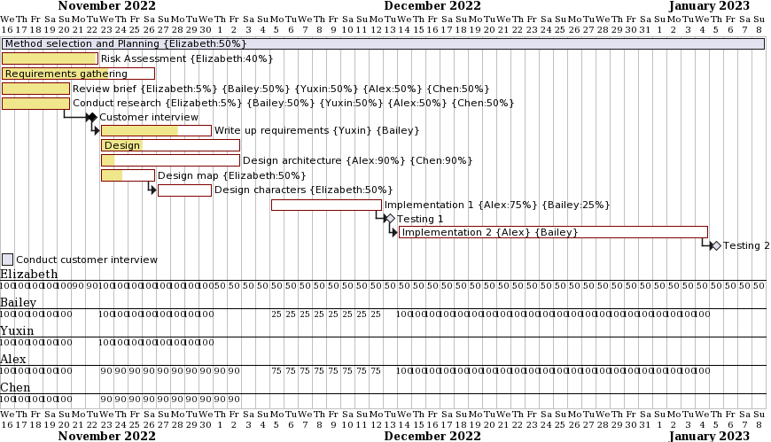
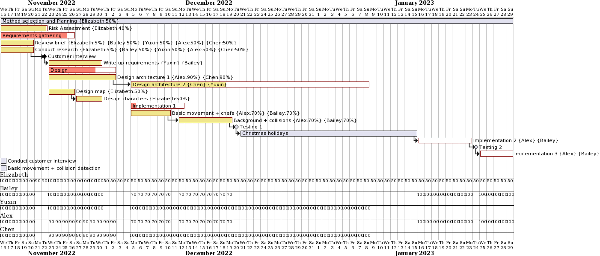
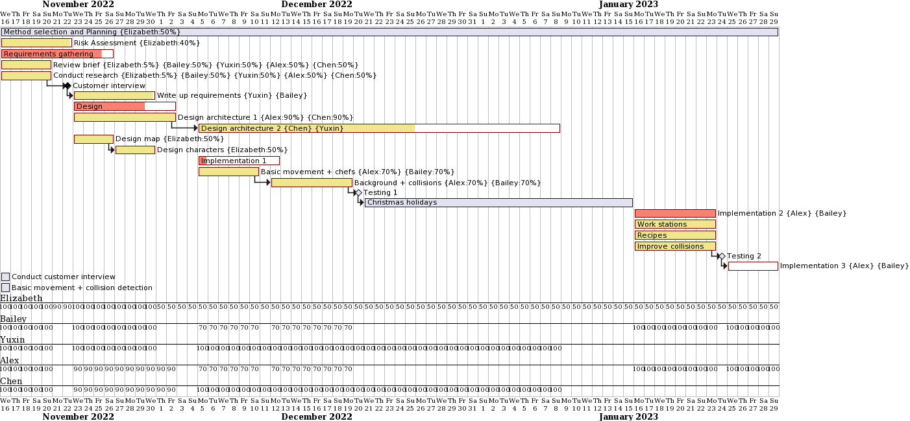
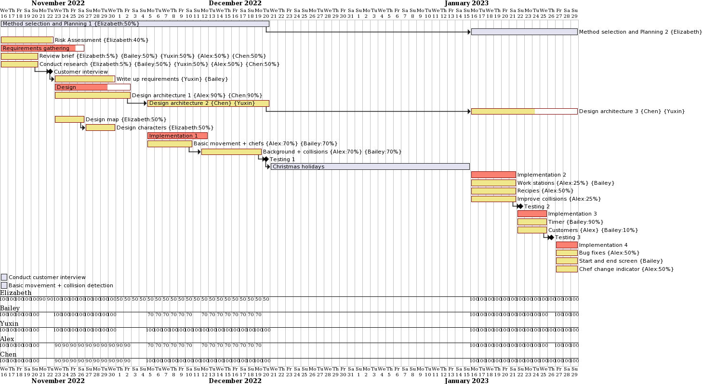
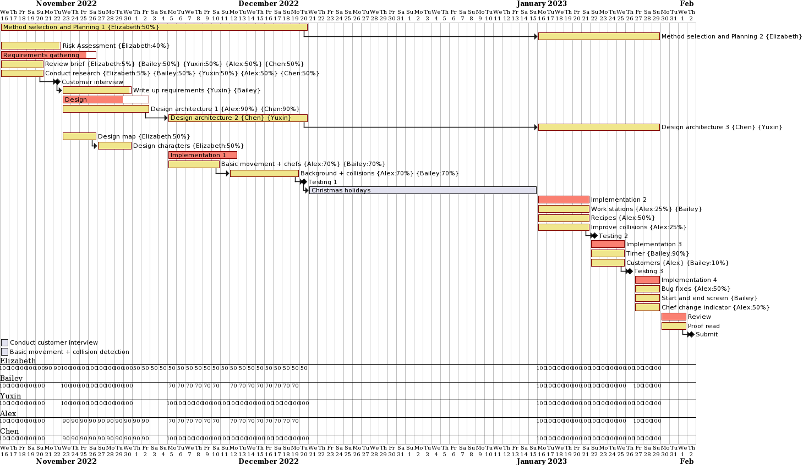

  

  <h1 align="center">Piazza Panic</h1>

  

    A LibGDX game for ENG1
     
    <a href="https://github.com/team13eng1/piazza-panic"><strong>Explore the docs »</strong></a>
     
     
    <a href="https://team13eng1.github.io/">Go Back</a>
  

<h3 align="center">Week 1</h3>

  

<h3 align="center">Week 2</h3>

  

<h3 align="center">Week 3</h3>

  

<h3 align="center">Week 4</h3>

  

<h3 align="center">Week 5</h3>

  

<h3 align="center">Week 9</h3>

  

<h3 align="center">Week 10 (1)</h3>

  

<h3 align="center">Week 10 (2)</h3>

  

<h3 align="center">Week 10 (3)</h3>

  

